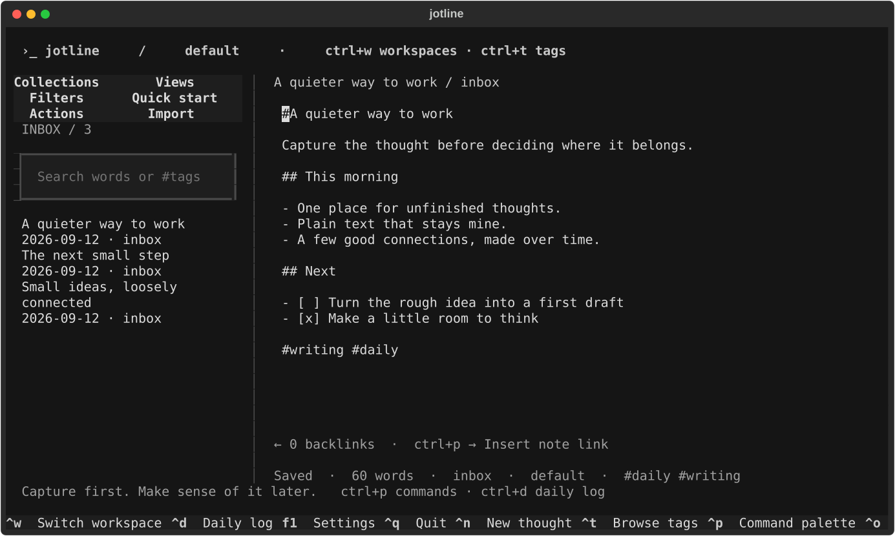
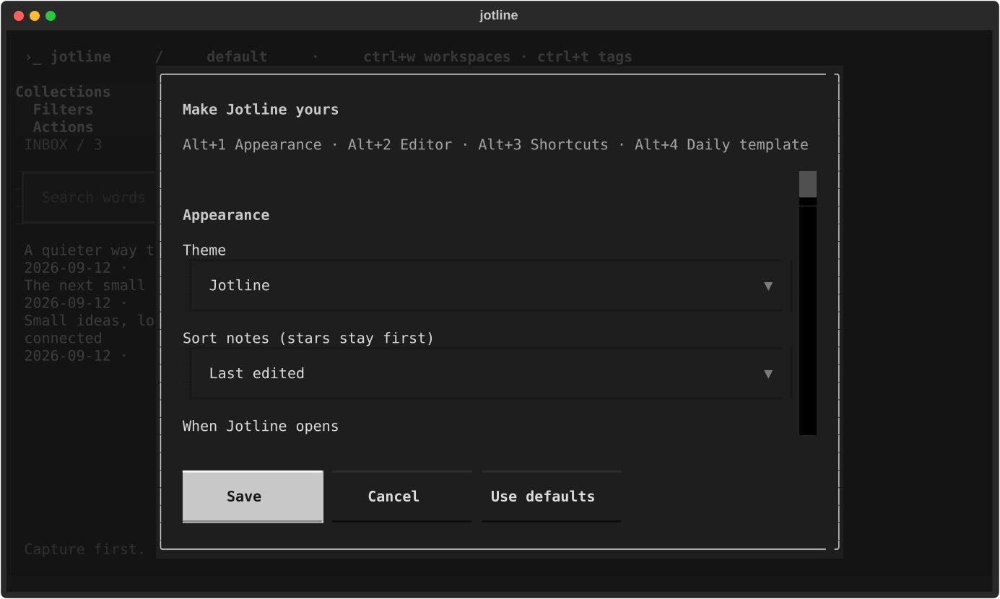
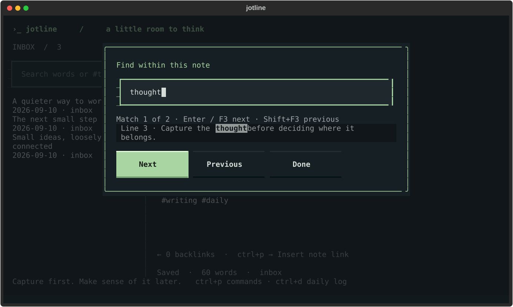

# ›_ jotline

**A little room to think.** A keyboard-first Linux terminal app for capturing thoughts, writing, and connecting notes. Inspired by the quick-capture spirit of Drafts, with an original terminal interface.



Jotline opens to a blank page. Start typing; your writing saves automatically to local Markdown files. Press `Ctrl+P` when you want to do something with it.

## Install

Requires Linux, Python 3.11+, and a terminal with Unicode and color support.

With [uv](https://docs.astral.sh/uv/):

```sh
uv tool install git+https://github.com/CaulShiver/jotline.git
jotline
```

Or with pipx:

```sh
pipx install git+https://github.com/CaulShiver/jotline.git
jotline
```

For development:

```sh
git clone https://github.com/CaulShiver/jotline.git
cd jotline
uv sync --extra dev
uv run jotline
uv run pytest
```

## The everyday loop

1. **Capture.** `Ctrl+N` starts a thought. No required title, folder, or tags.
2. **Log.** `Ctrl+D` opens today's page. Mix observations with Markdown tasks: `- [ ] Follow up`.
3. **Connect.** Keep durable ideas in separate notes. Insert links and follow backlinks through the command palette.
4. **Review.** Run **Start weekly review** for a checklist. Move notes into projects, areas, resources, or archive when useful.

These are optional practices, not a compulsory system. An inbox and search are enough to start.

The design draws on [Drafts' quick capture](https://docs.getdrafts.com/gettingstarted/), [GTD's capture and reflection](https://gettingthingsdone.com/what-is-gtd/), [Bullet Journal's daily rapid logging](https://bulletjournal.com/pages/how-to-bullet-journal), [Zettelkasten's connected ideas](https://zettelkasten.de/overview/), and [PARA's organization by use](https://fortelabs.com/blog/para/). Jotline is independent of these products and authors.

## Keyboard

| Shortcut | Action |
| --- | --- |
| `Ctrl+N` | New thought |
| `Ctrl+T` | Browse workspace tags |
| `Ctrl+W` | Switch or create workspace |
| `Ctrl+P` | Searchable command palette |
| `Ctrl+O` | Open a note by title |
| `Ctrl+D` | Today's daily log |
| `Ctrl+F` | Search across notes |
| `Ctrl+B` | Toggle quiet focus mode |
| `Ctrl+S` | Save immediately |
| `Ctrl+Q` | Save and quit |
| `Tab` / `Shift+Tab` | Move between controls |
| `Escape` | Close palette / return to writing |

The palette also offers star, move, restore from trash, task toggle, link insertion/navigation, backlinks, recovery copies, and a writing guide. Type words to narrow commands, use arrows to choose, then Enter. Standard text selection, undo, and redo are provided by the editor. Clipboard copy uses OSC 52 and depends on your terminal's permissions and support.

## Make it yours

Open **Ctrl+P → Settings**. Change preferences with Tab, arrows, and Space; choose
**Save** (or Ctrl+S) to apply them. Escape cancels. **Use defaults** fills the form
with the original settings; nothing changes until you save.

- **Nine themes**, including Jotline, Nord, Gruvbox, Dracula, Tokyo Night,
  Catppuccin Mocha, Solarized dark/light, and Textual light.
- **Editor:** line numbers, wrapping, and current-line highlighting.
- **Layout:** sidebar width, writing hints, and starting in focus mode.
- **Workflow:** open a blank thought or today's log, choose the collection for new
  thoughts, and sort notes by last edit, creation date, or title (stars stay first).
- **Autosave:** choose an interval from 0.2 to 5 seconds.
- **Daily template:** write your own Markdown structure. `{{date}}` inserts the
  current date. Existing daily logs are never replaced when the template changes.

Settings live in `.jotline-settings.json` inside each vault and survive restarts.
Shell capture uses the same default collection and daily template. Daily logs stay
in the inbox unless you move them. Font family and size come from your terminal.



## Search and links

Search matches all entered words across note bodies. `#work` matches an exact tag; `planning #work` combines a word and a tag. Search includes archived notes and excludes trash unless the trash collection is selected. Tags are case-insensitive and can be nested, such as `#project/launch`.

Use **Ctrl+P → Find within current note** to search the current document without
changing the vault search. Enter or F3 advances to the next match, Shift+F3 goes
back, and Escape returns to writing. **Refresh vault** updates the list and backlinks after
shell captures or external changes while retaining the current editor buffer.



Inserted links use `[[stable-id|Readable title]]`. Renaming a heading does not break these links. Manually entered `[[Exact title]]` links also work, but ambiguous titles can match several notes. Use **Follow a link in this note** and **Open a backlink** in the palette.

## Use it from your shell

```sh
jotline capture "A thought before I forget"
printf 'Meeting notes\n\nNext step: draft the outline\n' | jotline capture
jotline capture --daily "- [ ] Send the outline"
jotline list '#work'
jotline doctor
jotline import ~/Downloads/meeting.md
jotline export NOTE_ID > note.md
jotline path
jotline --vault ~/Notes/Jotline
```

Set `JOTLINE_VAULT` to use a different vault by default. Otherwise notes live in `$XDG_DATA_HOME/jotline/notes` (normally `~/.local/share/jotline/notes`).

`jotline doctor` checks the vault and settings, printing counts and diagnostics rather
than note bodies. It exits nonzero when it finds a problem. `jotline import FILE`
copies a regular UTF-8 file into a new note in your default collection; the original
file is left untouched.

Redirected export preserves the note body, including line endings. Export to an
interactive terminal refuses unsafe control characters unless you explicitly pass
`--raw`. Diagnostics escape terminal control characters.

## Tags and workspaces

Press **Ctrl+T** to browse tags and note counts in the current workspace. Select a
tag to filter notes, or use **Ctrl+P → Add tags to this note** to append tags such
as `#work #ideas #project/topic`. Tags are case-insensitive and stay in the Markdown
body: edit or remove them directly in the note. Search can combine words and tags.

Press **Ctrl+W** to switch or create a workspace, such as `work`, `personal`, or
`research`. **Ctrl+P → Move note to workspace** moves the current regular note.
Switching saves pending edits first and stops if saving fails. Jotline remembers
the workspace for your next launch and shell captures.

Each workspace scopes its collections, tag browser, search, note pickers, and
links. Daily logs are separate per workspace and stay in their original workspace;
copy their text into a regular note if you want to move that content. Appearance
and editor preferences remain shared for the vault.

Existing notes belong to `default`. Workspaces are organization, not access control:
**all Markdown files remain directly in your existing local notes folder**, with
workspace membership recorded in their front matter. Moving a note preserves its
filename and contents. A link to a moved note becomes visible again when both
notes are in the same workspace. No account, database, or new dependency is needed.
Workspace names use 1–48 lowercase letters, numbers, hyphens, or underscores,
starting with a letter or number. Use this version or later when editing workspace
notes; older versions do not preserve the new metadata field.

```bash
jotline workspaces
jotline --workspace work                  # open the terminal app
jotline --workspace work capture 'Meeting #team'
jotline --workspace work capture --daily 'Today’s progress'
jotline --workspace work tags
jotline --workspace work list '#team'
jotline --workspace work tag NOTE_ID ideas project/topic
```

Put `--workspace` before the subcommand. Without it, commands use the last
workspace selected in the app. `path` reports the shared vault folder and `doctor`
checks the entire vault.

## Your data

- Local `.md` files; no account, telemetry, hosted backend, or network requirement at runtime.
- Small Jotline front matter with JSON-valued fields stores collection, timestamps, and starred state.
- Atomic, fsynced saves. Normal exit saves pending edits. Abrupt termination may lose the last autosave interval (0.7 seconds by default; configurable).
- Jotline coordinates its own writers and detects external edits before saving. It will block navigation/exit on a save failure so the buffer remains available. **Save recovery copy** preserves your buffer as a new inbox note.
- Trash is reversible. There is no permanent-delete command.
- Keep a backup of your vault. Sync and encryption are up to your existing tools; simultaneous edits through an external editor or sync provider are not a collaborative editing protocol.
- Only the source code is published to GitHub. Your notes are stored separately.

Notes are limited to 10 MiB including metadata; settings to 256 KiB. Symbolic links
and special files are skipped and reported. A busy vault lock returns an error after
about one second so the app can recover instead of hanging.

External Markdown files can be placed directly in the vault with filenames containing letters, numbers, underscores, or hyphens. Existing non-Jotline front matter remains part of their body. Subdirectories and attachment management are not supported in this version. An in-memory cache avoids reparsing unchanged notes. Each scan still checks file
metadata for changes, and Refresh vault clears the cache. Very large vaults may
still need further indexing work.

## Status

Version 0.4 is an early release. It offers plain-text Markdown editing, not a rendered Markdown preview or a full Vim emulation. Cloud sync, plugins, dictation, and system-wide capture hotkeys are future work. Tested with Textual's headless terminal driver; terminal-specific clipboard behavior varies.

## Contributing

See the [multi-model review](docs/redteam-review.md) for findings, fixes, and test coverage.

Bug reports and focused pull requests are welcome. See [CONTRIBUTING.md](CONTRIBUTING.md). Licensed under [MIT](LICENSE).
