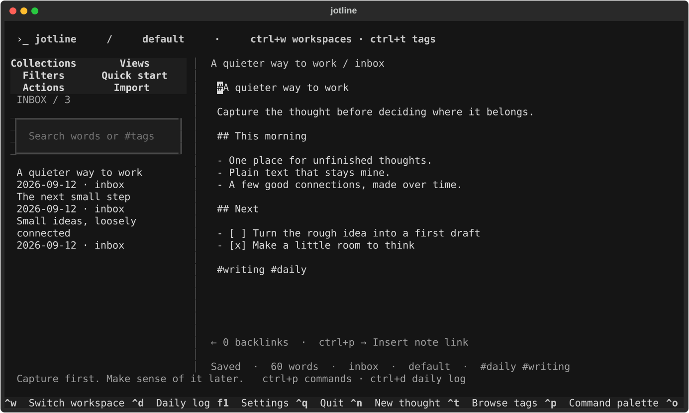

# ›_ jotline

**A little room to think.** A keyboard-first terminal app for Linux and macOS for capturing thoughts, writing, and connecting notes. Inspired by the quick-capture spirit of Drafts, with an original terminal interface.



Jotline opens to a blank page. The note list, formatting toolbar and hint stay
hidden until `Ctrl+F` (search) or `Ctrl+O` (open a note); `F8` toggles them.
Start typing; your writing saves automatically to local Markdown files, with no
account and no cloud. Press `Ctrl+P` when you want to do something with it. The
same notes are a shell command away, so a thought can go in from a hotkey or a
script and come out as a task list, a search result or HTML.

## Install

Linux and macOS. Python 3.11+. Git is not required. Windows is out of scope.
The same package is published for every supported OS.

```sh
uv tool install jotline
jotline
```

`pipx install jotline` works too. To install from a GitHub Release (checksum-verified
wheel), use the one-liner:

```sh
curl -fsSL https://github.com/CaulShiver/jotline/releases/latest/download/install.py | python3
```

To update, re-run the installer with `--force` (or `uv tool install --force jotline`).
Run `jotline backup` first. Uninstall with `uv tool uninstall jotline` or
`pipx uninstall jotline`; your vault remains on disk. See the
[install, update and rollback guide](docs/install.md) for checksums, pip, and
the encryption extra, and [supported platforms](docs/platforms.md) for the OS
contract.

For development (requires Git):

```sh
git clone https://github.com/CaulShiver/jotline.git
cd jotline
uv sync --extra dev
uv run jotline
uv run pytest
```

## Your first notes in five minutes

1. **Launch.** Run `jotline`. On an empty vault the quick start walkthrough opens
   once; Esc closes it.
2. **Type.** The page is already a note. It saves as you write; there is no
   title, folder or tag to fill in.
3. **Start another.** `Ctrl+N` begins a new thought.
4. **Find it again.** `Ctrl+F`, type a word or a `#tag`, then Enter opens the
   top result with the cursor ready to write. Down walks the list; Esc clears
   the search.
5. **Link.** Type `[[` and pick a note. `Ctrl+G` follows the link under the
   cursor, and `Alt+K` shows what links here.
6. **Log the day.** `Ctrl+D` opens today's daily log. Add tasks as
   `- [ ] Call Sam`; `Ctrl+L` ticks the one on the current line.
7. **Look up a key.** `F1` shows every key in effect, including your own
   changes. `Ctrl+R` reopens recent notes; `Ctrl+Q` saves and quits.

Everything else is in `Ctrl+P`: type a few letters of what you want, such as
`export`, `history` or `template`. Settings are on `Ctrl+,` (or **Ctrl+P →
Settings** if your terminal does not send it).

## The everyday loop

1. **Capture** with `Ctrl+N` or `jotline capture` from anywhere.
2. **Log** the day with `Ctrl+D`.
3. **Connect** durable ideas with `[[links]]` and **Extract selection to new note**.
4. **Review** with **Process next inbox note** and **Start weekly review**.

These are optional practices, not a compulsory system; an inbox and search are
enough to start. See [writing and review](docs/writing.md).

## Where your notes live

Notes are plain `.md` files in one folder, the vault:

| Platform | Default vault |
| --- | --- |
| Linux | `~/.local/share/jotline/notes` (under `$XDG_DATA_HOME` when set) |
| macOS | `~/Library/Application Support/jotline/notes` |

`jotline path` prints the active location. Set `JOTLINE_VAULT` to use another
folder by default, or pass `--vault PATH` to any command. Settings, history and
backups sit beside your notes in hidden `.jotline-*` files. See
[your vault](docs/vault.md) for what is stored where, filesystem requirements
and encryption.

## From the shell

```sh
jotline capture "A thought before I forget"     # Saved to inbox: A thought before I forget (3f9a8c21)
echo "half an idea" | jotline capture           # piped: prints only the note ID
jotline capture --daily "- [ ] Send the outline"
jotline list '#work'                            # or: jotline search '#work'
jotline open milk                               # exact title or ID, else the best title match
jotline tasks --due today
jotline done 3f9a8c21:4
jotline export last --output plan.html
```

`capture` with no text opens a small editor (Ctrl+S saves, Esc cancels); bind it
to a hotkey with `jotline desktop install` on Linux ([quick capture](docs/quick-capture.md)).
At a terminal it confirms in words; piped or redirected, it prints the bare ID.
Wherever a command takes a note you can give a 4+ character ID prefix, the exact
title, or `last`. Global options such as `--vault` and `--workspace` work before
or after the command. See [Jotline from the shell](docs/shell.md) for every
command, `--json` output and environment variables.

## If something goes wrong

- **A note changed or vanished:** **Ctrl+P → History of this note** restores an
  earlier version as a new note. Trashed notes come back from the Trash
  collection; there is no permanent delete.
- **Whole vault:** a ZIP backup is made each day you edit, in `.jotline-backups/`
  (`jotline backups` lists them; `jotline backup` makes one now).
- **Something seems off:** `jotline doctor` checks the vault and says what to fix.

Save conflicts, recovery copies and sync are covered in
[importing and recovering](docs/import-recovery.md) and
[your vault](docs/vault.md#history-and-backups).

## More

| Guide | What it covers |
| --- | --- |
| [Keyboard](docs/keyboard.md) | Every default key, the search box, rebinding, terminal caveats (Ctrl+,, Option-as-Meta, tmux) |
| [Writing and review](docs/writing.md) | The everyday loop, links, tasks, find and replace, templates, `$EDITOR` |
| [Markdown editing](docs/markdown.md) | Formatting, lists, preview, and the outliner |
| [Find your way around](docs/navigation.md) | Sidebar, search syntax, saved views, tags and workspaces |
| [Settings](docs/settings.md) | Themes, editor, layout, autosave, daily template |
| [Jotline from the shell](docs/shell.md) | Every command, global options, scripts, completion, environment variables |
| [Quick capture](docs/quick-capture.md) | The capture editor, desktop hotkeys, `JOTLINE_TERMINAL` |
| [Your vault](docs/vault.md) | Location, files, durability, history, backups, encryption |
| [Importing and recovering](docs/import-recovery.md) | Files, folders, Drafts exports, save conflicts |
| [Sync](docs/sync.md) | Git or Syncthing with your own remote |
| [Local actions](docs/actions.md) | Recipes, the builder, sharing, `jotline run` |
| [Note list menu](docs/note-menu.md) | Moving and trashing with the mouse |
| [Omarchy](docs/omarchy.md) | Following the desktop theme |
| [Install](docs/install.md) and [platforms](docs/platforms.md) | Checksums, updates, rollback, uninstall |

## Status

Version 0.9.10 is an early release: Markdown source editing, an inline outliner,
rendered preview, configurable local actions, and guided import and recovery.
See [CHANGELOG.md](CHANGELOG.md) and [ROADMAP.md](ROADMAP.md). Full Vim
emulation, cloud sync, plugins and dictation remain future work. IME composition
and screen readers need filled [native reports](docs/terminal-reports/) for 1.0;
see the [terminal and accessibility checklist](docs/terminal-testing.md) and
[release verification](docs/release-verification.md) for what is tested.

## Contributing

Bug reports and focused pull requests are welcome. The package version is sourced
from `src/jotline/__init__.py`; release builds and `jotline --version` use that same
value. See [CONTRIBUTING.md](CONTRIBUTING.md) for development and release checks,
[ROADMAP.md](ROADMAP.md) for starter contributions, and [SECURITY.md](SECURITY.md)
for private vulnerability reporting. Past reviews:
[multi-model review](docs/redteam-review.md) and
[September 12 hardening pass](docs/hardening-2026-09-12/hardening.md).
Licensed under [MIT](LICENSE).
