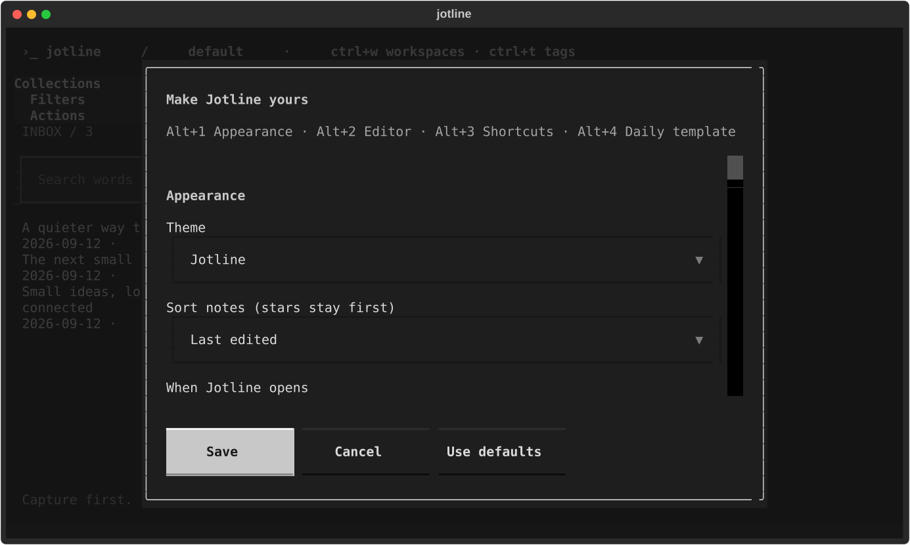

# Settings

Open Settings with **Ctrl+,**, or **Ctrl+P → Settings** if your terminal does
not send Ctrl+,. Change preferences with Tab, arrows and Space, then choose
**Save** (or Ctrl+S) to apply them. Escape cancels. **Use defaults** fills the
form with the original settings; nothing changes until you save.

- **Themes:** twenty-two built-in palettes, plus optional Omarchy desktop follow
  on Linux. See [Omarchy](omarchy.md).
- **Editor:** line numbers, wrapping, current-line highlighting, Markdown
  highlighting, and list continuation on Enter.
- **Outliner:** open notes in outliner mode by default. See
  [the outliner](markdown.md#outliner).
- **Layout:** sidebar width, writing hints, and starting on a blank page.
  A new vault hides the note list, toolbar and hint until Ctrl+F, Ctrl+O or F8.
- **Workflow:** open a blank thought or today's log at launch, choose the
  collection for new thoughts, and sort notes by last edit, creation date or
  title (stars stay first).
- **Autosave:** an interval from 0.2 to 5 seconds.
- **Daily template:** your own Markdown structure for new daily logs. `{{date}}`
  inserts the date. Existing daily logs are never replaced when the template
  changes.
- **Keyboard shortcuts** and **Outliner shortcuts:** see
  [changing a key](keyboard.md#change-a-key).

Settings live in `.jotline-settings.json` inside each vault and survive
restarts. Shell capture uses the same default collection and daily template.
Daily logs stay in the inbox unless you move them. Font family and size come
from your terminal. If the settings file cannot be loaded, Jotline starts with
defaults and the warning names the file.

