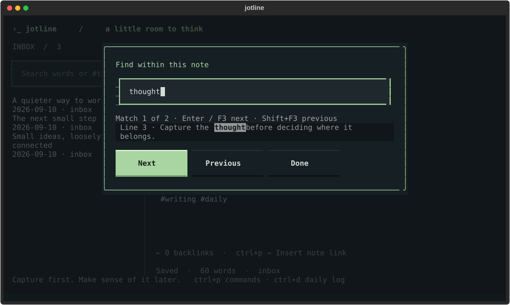

# Writing and review

Jotline opens to a blank page. Start typing; your writing saves automatically.
Press `Ctrl+P` when you want to do something with it. Everything below is
optional practice, not a compulsory system: an inbox and search are enough to
start.

## The everyday loop

1. **Capture.** `Ctrl+N` starts a thought. No title, folder or tags are required.
2. **Log.** `Ctrl+D` opens today's page. Mix observations with Markdown tasks:
   `- [ ] Follow up`. **Previous daily log**, **Next daily log** and **Open daily
   log by date** in the palette flip days (`YYYY-MM-DD`, `today` or
   `yesterday`); a missing day is created from your daily template.
3. **Connect.** Keep durable ideas in their own notes. Select a passage and run
   **Extract selection to new note** to leave a `[[link]]` behind. `Alt+K` (or
   **Show connections**) lists who links here and where this note points.
   `Ctrl+G` follows the link under the cursor, or offers to create the missing
   note.
4. **Review.** **Process next inbox note** opens the oldest capture (daily logs
   stay out of that queue). File it with **Move note to** a collection and the
   next capture opens; the status line shows how many remain. **Start weekly
   review** opens a checklist as a new note, saved only once you type into it.

**Open writing and workflow guide** shows the guide in a read-only window, so
opening it adds nothing to your inbox. **Quick start walkthrough** opens by
itself once, the first time `jotline` runs on an empty vault, and is always in
the sidebar and the palette.

The design draws on [Drafts' quick capture](https://docs.getdrafts.com/gettingstarted/),
[GTD's capture and reflection](https://gettingthingsdone.com/what-is-gtd/),
[Bullet Journal's daily rapid logging](https://bulletjournal.com/pages/how-to-bullet-journal),
[Zettelkasten's connected ideas](https://zettelkasten.de/overview/), and
[PARA's organization by use](https://fortelabs.com/blog/para/). Jotline is
independent of these products and authors.

## Links and connections

Inserted links use `[[stable-id|Readable title]]`, so renaming a heading does
not break them. Type `[[` to pick a note. Manually typed `[[Exact title]]` links
also work, but an ambiguous title can match several notes. **Follow a link**
(`Ctrl+G`) opens the link under the cursor; a missing target can create a note
and rewrite the typed title to a stable ID. Click a link in preview, or
Ctrl+click one in the editor. `[[links]]` inside fenced code or code spans are
examples, not connections, and typing `[[` there does not open the picker.

**Alt+K** lists incoming and outgoing notes with the line that contains each
link; the status line shows the counts as `←N →N`. When there are none, the bar
suggests typing `[[` or **Insert note link**. `jotline backlinks NOTE` prints
the same graph for scripts.

Note titles come from the first line without its Markdown markers, so a note
that starts `- [ ] buy milk`, `> quote` or `**Bold**` is listed, picked and
linked as "buy milk", "quote" and "Bold". The file is unchanged.

## Tasks

Write `- [ ] Call the plumber due:2026-10-03` anywhere. `Ctrl+L` toggles the
task on the current line. **Open tasks across notes** lists every open task,
dated ones first, and jumps to the one you pick; **Open tasks due today or
overdue** narrows it to what is owed now; **Tick off a task** checks one off
without leaving the list. The shell gives the same answers with `jotline tasks`,
`jotline tasks --due today` and `jotline done NOTE:LINE` ([details](shell.md#tasks)).
Obsidian's 📅 due marker is understood alongside `due:`.

## Find and replace in a note

**F3** opens **Find within current note**. It searches the open note without
changing the vault search. Enter or F3 advances, Shift+F3 goes back, and Escape
returns to writing.
Navigation moves past the selected match whether you selected its text forwards
or backwards, and clearing the search leaves the editor selection in place.

Enter replacement text and choose Replace or Replace all. Match case is
optional, replacements are literal, and Undo reverses one replacement. If a
replacement would exceed the note size limit, the text stays unchanged and the
dialog shows **Not replaced**; a rejected single replacement keeps the match
selected so you can shorten the replacement and retry.

## More writing tools

- **Jump to heading**, **Previous note** and **Recent notes** (`Ctrl+R`) move
  around a note's headings and the notes visited this session. Returning to a
  note restores its cursor position and its undo history; recent notes stay
  scoped to the workspace.
- **Extract selection to new note** saves the selection as an inbox note and
  leaves a `[[id|title]]` link. Undo reverses the replacement in the source.
- **Insert template at cursor** and **Insert note text at cursor** replace the
  selection or insert at the cursor. Type `;;` for template snippets; arrows and
  Enter choose, Escape cancels.
- **Arrange lines / Arrange paragraphs**: arrows select an item, Alt+Up/Down
  moves it, Ctrl+D duplicates it, Ctrl+S applies and Escape cancels. Apply is
  one Undo operation. Arrangement supports up to 256 KiB and 5,000 items.
- **Select notes for bulk operations**: Space selects notes from the current
  search, Ctrl+S opens operations: archive, trash, star, tag or merge. Merge
  creates a new inbox note and keeps the originals. Other operations report
  partial failures; notes processed successfully stay changed.
- **Move or delete with the mouse**: right-click a sidebar note, or focus it and
  press Shift+F10. See the [note list menu](note-menu.md).

## Your own editor

**Edit this note in $EDITOR** hands the note's file to the editor named in
`$JOTLINE_EDITOR`, `$VISUAL` or `$EDITOR`, gives it the terminal until it exits,
then reads the file back. The vault is plain Markdown, so nothing is converted
either way. An encrypted note stays in Jotline: the file on disk holds sealed
text. Assign a key for it in **Ctrl+, → Keyboard shortcuts**.

## Templates

**New note from template** offers meeting, project and journal starters
alongside your own. A template creates a new note in the active workspace and
default collection, after saving your current writing.

To make your own, write its structure in a note and choose **Save this note as a
template**, with a unique lowercase name such as `weekly-planning`. Custom files
live in `.jotline-templates/<name>.md` in your vault, are shared across
workspaces, and are included in ZIP backups. Existing names are never
overwritten by this command. You can also edit the files in any text editor.
**Copy template source to new note** keeps the placeholders so you can customize
a starter and save it under a new name.

| Placeholder | Inserts |
| --- | --- |
| `{{date}}`, `{{time}}`, `{{workspace}}` | Current local date, time and workspace |
| `{{date:%Y-%m-%d}}` | The date in a strftime format |
| `{{title}}`, `{{body}}`, `{{selection}}` | The current note's title, text or selection when inserting a template or running an action; empty for a new note from a template |
| `{{template:other-name}}` | Another template |

Inserted context is literal, and unknown placeholders stay unchanged. Includes
are limited to eight levels and 64 expansions, with a 10 MiB output limit. The
daily template in Settings accepts `{{date}}`.
