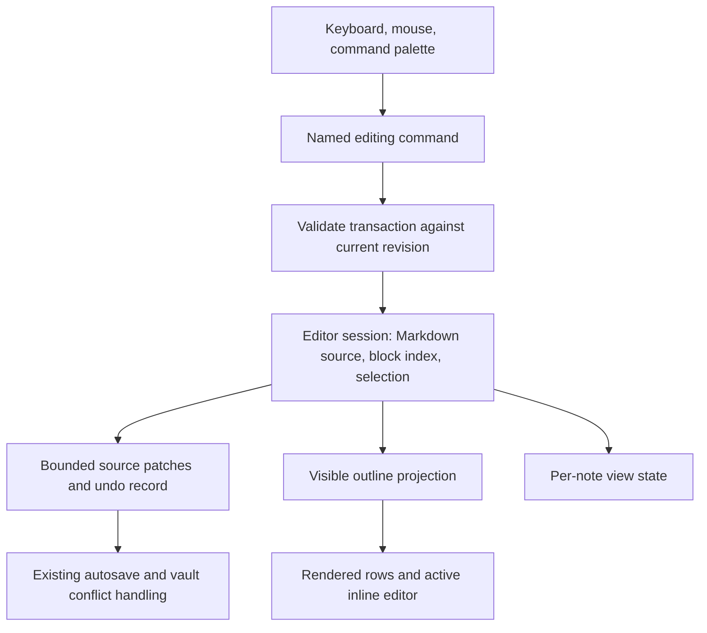

**Jotline outliner: research and improvement plan — 19 September 2026**

**Recommendation: repair block interpretation first, then make writing happen directly inside the outline.** The current implementation provides useful branch operations, but its Markdown model can assign text to the wrong branch. After fixing that, the largest product improvement is an inline editor with predictable text and branch selection, remembered navigation, and fast local updates.

This research covers the current working copy, including the outliner implemented in the preceding session. Its baseline Git commit is `6946d275b34ff98c3746fbf1d22727ac7bd79ca7`; the outliner files are uncommitted. Exact source hashes and runtime versions are recorded in [observations.json](observations.json). This report adds research artifacts only.

I used Exa to screen **70 search results across four workstreams**: editing; navigation/accessibility; Markdown correctness/identity; and editor architecture/performance. Fourteen searches included two targeted follow-ups. The inventory contains 70 distinct URL strings, but several describe equivalent documents, revisions, or mirrors; they are not 70 independent sources of corroboration. I requested closer page extraction for 17 pages, with some long pages truncated. Vendor documentation establishes behavior, not independent evidence of usability superiority. Generic homepages, secondary summaries, and anonymous performance claims did not determine the recommendations. See [search-inventory.json](search-inventory.json).

The investigation also used synthetic local correctness probes and microbenchmarks. These are stronger evidence about Jotline's implementation than feature comparisons, but they are not usability studies or full terminal-latency measurements.

**What established outliners suggest**

| Product or reference | Relevant observed behavior | Implication for Jotline |
| --- | --- | --- |
| Workflowy | Editing takes place on the node itself. Bullets zoom into branches; disclosure arrows fold them; breadcrumbs navigate to ancestors. | Put the writing cursor in the outline. Make folding and focusing distinct, visible actions. |
| Bike | Text editing and outline editing are explicit modes. Whole-row selection changes the meaning of move, indent, duplicate, and delete. | Distinguish a text selection from a branch selection without forcing a separate editing pane. |
| Dynalist | Multiple selected items receive bulk actions. “Move to…” finds a destination, including another document. | Add multi-block selection and destination search before investing in mouse drag-and-drop. |
| W3C tree guidance | Focus and selection are separate concepts; arrow navigation, Home/End, and type-ahead have defined behavior. | Specify navigation and selection as a small interaction contract. Verify the actual terminal experience separately. |

Sources: [Workflowy editing](https://workflowy.com/help/add-edit-format/), [Workflowy navigation](https://workflowy.com/help/navigate-around/), [Bike outline editing](https://bikeguide.hogbaysoftware.com/using-bike/outline-editing.md), [Bike text editing](https://github.com/jessegrosjean/BikeGuide/blob/main/using-bike/text-editing.md), [Dynalist selection](https://help.dynalist.io/article/77-select-multiple-items), [Dynalist movement](https://help.dynalist.io/article/54-move-lists), [W3C tree pattern](https://www.w3.org/WAI/ARIA/apg/patterns/treeview/).

There is no single universal outliner keyboard contract. For example, Workflowy's Shift+Enter opens an attached note field, while Jotline currently inserts a continuation line. Bike deliberately allows some text-mode operations to ignore branch boundaries, while its outline mode preserves them. These differences argue for explicitly choosing Jotline's behavior, documenting it, and testing it. They do not justify importing every competitor shortcut.

**The most urgent findings are correctness issues**

The five observations below are reproduced by [probes.py](probes.py). They use the real outline model; the delete reproduction removes the same block object from the same siblings list as the UI action. No user notes were opened or changed.

| Finding | Observed result | Why it matters |
| --- | --- | --- |
| Parent continuation after a child | The parent paragraph becomes part of the child's `lines`. Deleting that child also removes the parent paragraph. | A branch operation can affect text outside the intended branch. |
| Multiline text beginning with a list marker | A continuation entered within a block becomes an additional child after serializing and reparsing. | The live tree and reopened tree disagree. |
| Unfinished fence inside a list item | Reopening can absorb a later top-level sibling into the fenced block. | The parser does not respect the containing list item's boundary. |
| Indented code beginning with a bullet | A code line is exposed as a list block. | Rearranging it can change code into document structure. |
| Numbered item with insufficient child indentation | The outliner nests a line that CommonMark parses at top level. | Structure in the outliner can differ from exported Markdown. |

The first case is particularly important:

```markdown
- Parent
  - Child

  Parent paragraph
- Other
```

CommonMark places `Parent paragraph` in the parent list item. Jotline currently attaches it to `Child`. Removing that child produces:

```markdown
- Parent
- Other
```

The text is genuinely removed in this model operation; it is not merely folded. The existing undo machinery may recover the edit, but it does not make the ownership decision correct.

The underlying representation assumes all of a block's own lines appear before all of its children. Markdown permits a parent to contain a paragraph, then a nested list, then another parent paragraph. A richer ordered representation or source-range model is needed. Relevant code: [outliner.py](../../src/jotline/outliner.py), particularly `Outline.__init__` around line 89 and `Outline.text` around line 105.

Similarly, editing a block to contain `Parent\n- continuation` writes an indented bullet. The in-memory model still treats that line as text inside the block, but reparsing creates another child. An unfinished fence can also make the reopened parser consume `- Other` even though a CommonMark parser terminates that fenced section at its containing list boundary. These are separate failures: stale live structure and incorrect parsing.

CommonMark's nesting rules depend on the list marker width and the following indentation; tabs use four-column stops for structural parsing. Jotline currently uses a simpler indentation comparison and two-column tab expansion. Choosing two spaces for newly generated outlines is reasonable; treating all imported Markdown according to that simplified rule is not equivalent to CommonMark. [CommonMark list items](https://spec.commonmark.org/0.31.2/#list-items), [tabs](https://spec.commonmark.org/0.31.2/#tabs), [fenced blocks](https://spec.commonmark.org/0.31.2/#fenced-code-blocks).

**Required first change:** define the supported Markdown dialect, preserve untouched source ranges, and make the displayed tree agree with that source after every committed structural edit. An ordinary open/close byte comparison is insufficient: the examples above can pass byte round-trip checks while assigning text to the wrong node.

Jotline already uses `markdown-it-py` for HTML export. Its parser exposes nested tokens with line maps, making it a useful starting point and comparison oracle. However, an AST renderer alone does not preserve the original formatting: retain the source and apply bounded patches. If the outliner depends directly on this library, declare that dependency explicitly and align parser options with preview/export. [Existing export implementation](../../src/jotline/export.py), [markdown-it-py token and parser documentation](https://markdown-it-py.readthedocs.io/en/latest/using.html).

**The main product change should be inline editing**

The current [outliner screen](../../src/jotline/outliner_ui.py) gives half the writing area to a tree and half to one block. It requires moving between those panes to edit neighboring blocks. That is a workable navigation interface, but it creates friction in continuous writing.

My recommendation is a single outline surface: inactive blocks render as rows, and the active block becomes editable at the same location. Keep the separate block pane available as an optional inspector for long content. Treat this as a product hypothesis to validate with the user, rather than a proven universal preference.

The next interaction contract should cover:

| Context | Proposed behavior | Acceptance example |
| --- | --- | --- |
| Text editing | Typing and selection operate on block content; the caret remains visible within the outline. | Edit three neighboring blocks without switching panes. |
| Enter at beginning | Insert an empty preceding sibling, preserving the original block and children. | No empty parent unexpectedly takes ownership of existing children. |
| Enter in the middle | Split the text; explicitly specify which block retains children and identity. | Undo restores text, hierarchy, and caret in one structural transaction. |
| Enter at end | Create a sibling after the current branch; provide a separate explicit “new child” command. | The same rule applies whether children are folded or expanded. |
| Empty nested block | Outdent one level. | Repeated Enter can leave a nested list predictably. |
| Continuation line | Insert a line within the block; make literal text versus structural Markdown explicit. | A pasted `- ` does not silently become a child only after reopening. |
| Backspace at block start | Join with a previous editable block when valid; otherwise give a clear no-op. | Children, tasks, and code containers are handled by documented rules. |
| Up/Down at content boundary | Move to the previous/next visible block, preserving a sensible text column. | Navigation respects wrapping, folded branches, Unicode, and focus scope. |
| Branch selection | Select whole blocks separately from text. Reduce parent-plus-child selections to their topmost selected roots. | Moving a selected parent and child does not move the child twice. |

These are proposed Jotline rules, not claims that all competitors behave identically. The precise split/merge cases need an explicit table before implementation. Bike's separate text and branch selections and Logseq's dedicated insert/delete/block-selection code illustrate why these operations deserve a domain-level specification. [Bike editing](https://github.com/jessegrosjean/BikeGuide/blob/main/using-bike/text-editing.md), [Logseq editor implementation at a fixed revision](https://github.com/logseq/logseq/blob/4cad271f/src/main/frontend/handler/editor.cljs).

**Make the outliner part of normal Jotline navigation**

Today `OutlinerScreen` is a modal. `Jotline.check_action` disables normal application actions while a modal is active. Consequently, the outliner cannot simply reuse the normal command palette, note navigation, or formatting actions. This is an architectural integration issue, not a missing toolbar button. [app.py, check_action](../../src/jotline/app.py), [outliner_ui.py](../../src/jotline/outliner_ui.py).

Make it a first-class writing mode, or provide an explicit mode-aware command dispatch layer. Commands should operate on the active editing surface. Opening another note, visiting the daily log, formatting, invoking link completion, and returning to the previous note should have deliberate behavior.

The most valuable navigation additions are:

- Search within the outline, showing a match with its ancestor path.
- A “Move to…” destination picker, initially within the same note.
- Clickable ancestor breadcrumbs and back/forward history.
- Multi-block selection, duplicate, cut/copy/paste as an outline, and grouping.
- Remembered folds, focused branch, caret, and scroll position per note.
- A default writing-mode preference so returning users can open directly into the outliner.

Cross-note moves should follow once same-note transactions are reliable. They need both source and destination saves to succeed, with recovery for conflicts. They are materially more complex than rearranging one document.

**The state model should survive undo and reopening**

`Block` currently has object identity but no durable identifier. Undo reconstructs the whole outline, chooses a block by its old row number, clears focus, and rebuilds the tree. This explains the documented reset of folds and focus. It also means an old row number may identify different content after a structural edit. [Block model](../../src/jotline/outliner.py), [history implementation](../../src/jotline/outliner_ui.py).

Introduce session-stable block IDs and explicit selection state. Transactions should record the relevant source edits, block-ID mapping, and selection before/after. Ordinary undo should preserve unrelated folds and keep the user near the restored content. View-only operations should not fill the text undo history.

For reopening, a sidecar can preserve view state against a known note revision without changing Markdown. Reconciliation after arbitrary external edits is necessarily harder, especially with duplicate block text. Restore only unambiguous matches; otherwise fall back to a safe visible location. A content hash is a revision check, not a permanent identity.

A useful architecture is:



The Markdown source remains authoritative; the block index is derived from it and updated through the same transaction boundary. Both the raw editor and outliner should use that session. This avoids independently mutating a tree, a block editor, and a hidden full-note editor with different histories.

ProseMirror is a useful architectural reference: it models document and selection changes through transactions and position mapping. Borrow that separation of concerns; it does not imply adding ProseMirror or a browser runtime to this terminal app. [ProseMirror guide](https://prosemirror.net/docs/guide/#state), [transactions and state reference](https://prosemirror.net/docs/ref/#state.Transaction).

**Performance needs local updates**

`OutlinerScreen.sync` serializes the complete outline and scans the old/new strings to find a small edit on each content change. Structural operations and folding call `rebuild`, which clears and recreates the tree nodes. Sending only a small resulting patch does not eliminate the preceding whole-document work. [sync and rebuild](../../src/jotline/outliner_ui.py).

The saved synthetic run produced:

| Blocks | Source bytes | Parse, median ms | Sync preparation, median ms | Unmounted tree construction, median ms |
| ---: | ---: | ---: | ---: | ---: |
| 100 | 6,999 | 0.28 | 1.21 | 2.29 |
| 1,000 | 69,999 | 2.83 | 13.23 | 21.41 |
| 5,000 | 349,999 | 16.76 | 67.77 | 103.56 |
| 10,000 | 699,999 | 38.14 | 133.88 | 259.82 |

Environment: Python 3.12.14, Textual 8.2.8, markdown-it-py 4.2.0 on the current Linux machine. Parse uses seven runs, sync eleven, and tree construction three. Sync executes the actual method with downstream source-position conversion, editor mutation, and application updates stubbed. Tree construction is unmounted and simpler than the real screen rebuild. These figures exclude painting, I/O, autosave, and real terminal input. Exploratory runs varied; treat them as evidence of scaling cost, not fixed latency predictions.

Replace global diff discovery with patches generated by the command itself. Maintain source-position mappings and invalidate the changed container when parsing needs it. Cache wrapped rows by block revision and viewport width; render visible rows and update affected regions.

Textual's Line API and `ScrollView` explicitly support line-based rendering, virtual size, and small-region refresh. A feasible design to prototype is a line-rendered outline plus one reusable active text editor positioned over the current row. A `ScrollView` is not a normal child-widget container, so put the editor in a coordinating parent/overlay rather than assuming it can simply be mounted inside the line widget. Test wrapping, selection, mouse hit-testing, scrolling, IME, and focus before committing to this design. [Textual Line API](https://textual.textualize.io/guide/widgets/#line-api), [ScrollView API](https://textual.textualize.io/api/scroll_view/).

Bike's creator similarly describes rendering work in terms of visible text and using row IDs, although his performance comparisons are vendor claims, not independent benchmarks. This supports the architectural direction; it does not establish that Jotline will achieve Bike's performance. [Creator's implementation notes](https://news.ycombinator.com/item?id=31409077).

**Terminal controls need reachable alternatives**

The current design relies on Shift+Enter, Ctrl+Enter, Ctrl+Tab, and Ctrl+Space. Legacy terminal encodings can collapse distinct key combinations into identical byte sequences. The keyboard protocol specification explicitly lists Enter, Ctrl+Enter, and Shift+Enter as the same legacy byte. Headless `pilot.press('shift+enter')` tests bypass that encoding problem. [Kitty keyboard protocol, legacy key table](https://sw.kovidgoyal.net/kitty/keyboard-protocol/#legacy-key-event-encoding).

Give every structural action a command-palette entry and a discoverable menu alternative; specifically add an explicit “Insert continuation line” action. Allow remapping the outliner actions, not just the shortcut that opens the screen. Inspect the installed Textual driver's negotiated protocol rather than adding a competing terminal protocol implementation.

Use W3C tree navigation as a behavioral reference, not as proof of terminal accessibility. Verify keyboard focus, visible selected state, collapsed state, and reading order with actual supported terminals and the existing Orca/VoiceOver validation workflow. Text navigation and tree navigation must not fight over the same arrows. [W3C tree keyboard interaction](https://www.w3.org/WAI/ARIA/apg/patterns/treeview/#keyboardinteraction).

**Block links should follow stable identity**

Block references, embeds, and backlinks can be valuable later. They should follow the identity and transaction work, because references based on line numbers or text break when blocks move or repeat.

Obsidian exposes explicit block identifiers and documents their interoperability limits. Logseq's current Markdown Mirror specification describes a particular DB-graph export syntax; it should not be confused with every historical file-graph convention. Therefore, “Logseq compatible” needs a defined import/export target. [Obsidian block links](https://github.com/obsidianmd/obsidian-help/blob/master/en/Linking%20notes%20and%20files/Internal%20links.md), [Logseq Markdown Mirror syntax at a fixed revision](https://github.com/logseq/logseq/blob/3de7c751/docs/logseq-markdown-syntax.md).

For Jotline, start with session IDs. When block references become necessary, choose and document explicit persistent anchors, ideally only adding an anchor when a block is linked. IDs for clipboard copies must be regenerated where appropriate. Live mirrors introduce shared-edit semantics and cycle handling, so simple references should precede them. None of the immediate outliner improvements requires moving the vault into a database.

**Recommended implementation order**

| Stage | Deliverable | Completion criteria |
| --- | --- | --- |
| 1 — Correctness | Supported Markdown grammar, ordered source ownership, edit/reparse agreement, protected handling of ambiguous containers. | All five recorded reproductions pass corrected invariants. Unrelated source text survives branch operations. |
| 2 — Editor foundation | One transaction boundary, session block IDs, source-range patches, stable selection and undo. | Split, merge, move, delete, and undo restore the expected content and editing location without resetting unrelated folds. |
| 3 — Writing experience | Inline editing, boundary navigation, integrated palette, portable action alternatives, remembered view state. | Routine capture and revision require no pane switching; every essential action remains reachable without enhanced key encoding. |
| 4 — Organization | Multi-selection, outline clipboard, move picker, contextual search, clickable breadcrumbs. | Bulk operations execute once per selected branch; hidden matches can be reached and original view state restored. |
| 5 — Optional links | Persistent block anchors, references, then embeds if needed. | References survive movement and renaming under the documented format; duplicate/paste identity rules are tested. |

Performance work belongs in stages 2–3. Avoid mounting a full editor per block or rebuilding all nodes for a simple fold. Defer graph visualization, collaboration protocols, plugin infrastructure, and complex task databases until writing behavior and correctness are established.

**Validation should test operation sequences and actual writing tasks**

The previous successful test suites establish the behaviors they assert. They do not prove semantic equivalence to Markdown, portable key delivery, or acceptable latency at large sizes. Add these independent checks:

1. **Stateful model tests:** generate edit, split, join, indent, outdent, move, delete, undo, redo, serialize, and reload sequences. Check source ownership, parent/child consistency, unique IDs, acyclicity, block order, unaffected text, and selection mapping.
2. **Differential Markdown tests:** compare the supported subset against the chosen parser, including continuation after sublists, marker width, tabs, indented code, fence boundaries, quotes, tables, and literal pasted markers.
3. **UI workflow tests:** use wrapped text, mixed-width Unicode, backward selections, collapsed branches, focused subtrees, resize, paste, save conflict, and reopening.
4. **Real terminal checks:** record actual key delivery and accessible navigation on the supported Linux/macOS terminal matrix.
5. **Usability comparison:** capture ten items at three depths, revise neighboring blocks, move five branches together, find a hidden item, then undo and reopen. Compare completion time, mode switches, mistakes, and user preference between the current pane layout and the inline prototype.

Hypothesis's stateful testing is a suitable tool for generating and shrinking operation sequences; begin with the minimal recorded cases and an independent reference model. [Hypothesis stateful testing](https://hypothesis.readthedocs.io/en/latest/stateful.html).

Proposed performance budgets, to validate on a named reference machine: p95 input-to-paint below 50 ms for 1,000 blocks; below 100 ms for 10,000 blocks; typical branch operations below 100 ms; and initial outline display below 500 ms for 10,000 synthetic blocks. These are proposed engineering targets, not established standards or measured current results. Benchmark wrapped and deeply nested outlines as well as flat ones.

The next implementation should begin with the parent-content deletion reproduction and the serialize/reparse disagreements. Those fixes establish the foundation for a substantially better inline outliner.

Reproduce the saved research observations from the repository root:

```bash
.venv/bin/python exa-results/jotline-outliner-2026-09-19/probes.py
```

Artifacts: [observations and timings](observations.json), [probe implementation](probes.py), [search inventory](search-inventory.json).
